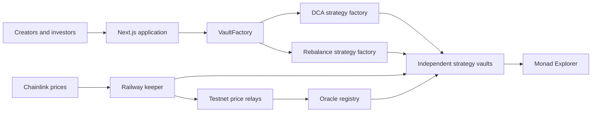

<p align="center">
  
</p>

<h1 align="center">Cadence</h1>

<p align="center">
  <strong>The open strategy layer for onchain investing.</strong>
</p>

Investment strategies have traditionally been restrictive. Institutions decide which products get created, platforms decide which products get listed, and most investors can only choose from the finished menu.

**Cadence opens up the strategy layer.** Any wallet can turn an investment idea into a public, investable vault on Monad. Other users can discover it, deposit capital and receive shares representing their ownership. Automation then runs the published rules transparently onchain.

The hackathon version supports Dollar Cost Averaging and threshold rebalancing. A live keeper executes eligible strategies, Chainlink pricing protects trades, and a TVL leaderboard turns attracting capital into a competition.

> Cadence is a testnet hackathon project. The contracts are unaudited and must not be used with real funds.

## Why Cadence matters

DeFi made assets open, but creating an investable strategy is still difficult. A creator normally needs to write and deploy contracts, build an interface, attract investors and operate automation. Cadence packages that entire workflow into one permissionless protocol:

1. A strategist chooses the logic and deploys a vault from the frontend.
2. Investors deposit into that vault and receive transferable vault shares.
3. An independent keeper monitors the strategy and executes it when eligible.
4. Every deposit, execution and withdrawal remains verifiable on Monad.

There are no separate creator and investor account types. A wallet becomes a creator by deploying a vault and becomes an investor by owning its shares. The same wallet can be both.

| Restrictive model                          | Cadence                                          |
| ------------------------------------------ | ------------------------------------------------ |
| Institutions create investment products    | Any wallet can launch a strategy                 |
| Platforms control distribution             | Every vault is publicly discoverable             |
| Strategy rules may be opaque or changeable | Rules are encoded in the deployed vault          |
| Investors depend on a central operator     | Execution is automated and permissionless        |
| Ownership lives in a platform account      | Ownership is represented by onchain vault shares |

Cadence turns strategy creation into an open marketplace: creators compete to design useful strategies, while investors decide which strategies deserve capital.

## Standout features

### Permissionless strategy creation

Any connected wallet can deploy a new vault through the primary `VaultFactory`. The protocol registers trusted strategy implementations, while vault creation itself stays open to everyone. Adding a future strategy does not require replacing the factory or redesigning the application.

### Two automated strategies

**Dollar Cost Average** invests a fixed amount of the deposit token into the target token on a chosen schedule. The five-second demo interval makes the automation visible during a short presentation.

**Threshold Rebalance** maintains a selected target-token allocation. It only trades when the portfolio moves outside its allowed drift band, avoiding unnecessary executions while it remains on target.

### Shared, investable vaults

Each strategy is its own standards-based tokenized vault. Multiple investors can deposit into the same strategy, receive shares and withdraw their proportional position. The dashboard calculates both the connected wallet's position value and its percentage ownership of the vault.

### TVL leaderboard

The Vaults page ranks every strategy by live total value locked. The highest-TVL vault becomes the protocol champion, giving creators a visible incentive to build strategies that attract capital.

### Automated keeper execution

The TypeScript keeper runs independently from the frontend. Every five seconds it checks registered vaults and executes eligible DCA purchases or rebalances. Execution is still permissionless: if the keeper is unavailable, any user can trigger an eligible action from the dashboard.

The keeper cannot choose a worse slippage limit. Each vault independently calculates its minimum acceptable output before allowing a swap.

### Chainlink-powered pricing and protection

Cadence uses Chainlink MON/USD, ETH/USD and USDC/USD prices to value each vault's mixed-token holdings, calculate rebalance allocations and set a protected minimum output for swaps. If a price is invalid or stale, execution stops safely.

For the testnet demo, the keeper relays newer Chainlink rounds from Monad mainnet to dedicated testnet feeds. Chainlink does not hold funds or execute strategies: the keeper submits transactions, while each vault holds the assets and enforces the price protection onchain.

### Native MON deposits

Users can deposit faucet MON directly. A deposit router wraps it 1:1 into official testnet WMON and deposits it into the selected vault in a single transaction.

### Transparent strategy dashboards

Every vault has a live dashboard showing:

- TVL, share price and return measured in the deposit asset
- The connected investor's position and percentage ownership
- Idle and invested balances
- Execution count, schedule and next eligible execution
- DCA tranche size or rebalance allocation status
- Total assets invested and target tokens acquired
- Recent onchain executions with Monad explorer links
- Deposit, withdrawal and permissionless manual-execution controls

Recent activity is read from contract events, so it is shared onchain data rather than browser-local history.

## Three-minute demo walkthrough

Before presenting, make sure the Railway keeper is running and its log begins with `Keeper 0x...`.

1. **Create:** Connect a wallet, select DCA, choose Monad as the deposit token and WETH as the target, select the five-second frequency and deploy the vault.
2. **Invest:** Open the new vault and deposit a very small amount of faucet MON. Cadence wraps and deposits it in one transaction.
3. **Automate:** Wait for the keeper. The dashboard execution count and recent activity update after an eligible DCA purchase is confirmed.
4. **Verify:** Open the execution link on Monad Explorer to show that the automation happened onchain.
5. **Compete:** Open the Vaults page to show the strategy ranked against every other vault by TVL.
6. **Expand:** Switch the creation form to Rebalance to demonstrate that the same protocol supports different strategy logic without changing the primary factory.

Keep demo deposits small. The five-second setting controls eligibility; actual confirmation time also depends on block inclusion and RPC response time.

## How the system fits together



The frontend never holds the keeper key. Vercel hosts the user interface, while Railway hosts the continuously running worker.

## Demo assets

| User-facing asset | Demo implementation         | Notes                                               |
| ----------------- | --------------------------- | --------------------------------------------------- |
| Monad             | Official Monad testnet WMON | Native faucet MON is wrapped 1:1 when deposited     |
| USDC              | Test USDC                   | Six decimals and Chainlink-based USD valuation      |
| WETH              | Test WETH                   | Eighteen decimals and Chainlink-based ETH valuation |

USDC and WETH are test representations used to demonstrate realistic vault accounting. They have no real-world value and can be requested from the in-app faucet. Monad/WMON is the official testnet asset.

## Deployed Monad testnet contracts

| Contract                   | Address                                      |
| -------------------------- | -------------------------------------------- |
| VaultFactory               | `0x8947670a7C9147BA258234aE7FdEE6191e95fd1f` |
| DCA strategy factory       | `0xf96cb71BB6BC01312Afadab939aCCAd6531db9f6` |
| Rebalance strategy factory | `0x2284f98F4e1685DFCE6B092bb29fcC28DF91a07d` |
| Chainlink oracle registry  | `0x20EE4F01b31b4D2846Da3a436C3013785bDfC9Fd` |
| Inventory swap adapter     | `0x4D7f5029f4154c7B998a69ea521C75E72d3e4C68` |
| Native MON deposit router  | `0x00EA9027E3601608ab1B0A68b5753Fd2A4F2b82F` |
| Demo USDC                  | `0x37F8f050Bb677e588c60F4614D24CAe2d9a0B324` |
| Official WMON              | `0xFb8bf4c1CC7a94c73D209a149eA2AbEa852BC541` |
| Demo WETH                  | `0x9cF74BaFaabAeB901C7d88b195d72F6D497487e9` |
| USDC/USD relay             | `0xFfFf324649aB0D50eBeD4bb83c90fc7C5Cc7dac2` |
| MON/USD relay              | `0x910EB659119Eac93001e192f1B2Cc7c038A61CA5` |
| ETH/USD relay              | `0x0b406fB7F796B4387cdBa4815bCf7B6Ca46C56d6` |

## Technology

| Layer             | Technology                                     |
| ----------------- | ---------------------------------------------- |
| Network           | Monad testnet                                  |
| Contracts         | Solidity, Foundry, OpenZeppelin                |
| Vault standard    | ERC-4626                                       |
| Pricing           | Chainlink-compatible feeds and oracle registry |
| Frontend          | Next.js 16, React, TypeScript                  |
| Blockchain client | viem and wagmi                                 |
| Wallet connection | RainbowKit and Reown                           |
| Keeper            | TypeScript worker hosted on Railway            |
| Frontend hosting  | Vercel                                         |

## Repository structure

```text
apps/web/       Next.js frontend and vault dashboards
apps/keeper/    Automated strategy executor and price relay
contracts/      Solidity contracts, tests and deployment scripts
DEPLOYMENT.md   Vercel and Railway deployment guide
```

`VaultFactory` is the primary protocol entry point. Each strategy has a dedicated factory and vault implementation behind it, while `ISwapAdapter` keeps exchange-specific routing separate from the strategy logic.

## Run locally

Requirements: Node.js 22+, pnpm 10+ and Foundry.

```bash
pnpm install
forge install --root contracts --no-git foundry-rs/forge-std
forge install --root contracts --no-git OpenZeppelin/openzeppelin-contracts
pnpm dev
```

Open:

- `/` to create a strategy
- `/vaults` to browse the TVL leaderboard
- `/vaults/<address>` to invest, withdraw and inspect a vault

Local RPC, Reown and contract settings live in the gitignored `apps/web/.env.local`. Use `apps/web/.env.example` when configuring another machine.

### Run the keeper locally

```bash
cp apps/keeper/.env.example apps/keeper/.env.local
pnpm keeper
```

The keeper requires a dedicated testnet wallet funded with only enough MON for gas. It automatically switches to an independent fallback RPC when the primary provider is unavailable or rate limited.

### Run checks

```bash
pnpm lint
pnpm build
pnpm keeper:check
pnpm contracts:test
```

## What comes next

Cadence is designed to grow by registering new strategy factories. Natural extensions include scheduled yield allocation, multi-vault portfolio strategies, automated fee sharing for creators, keeper incentives, account abstraction and AI-assisted strategy configuration.
